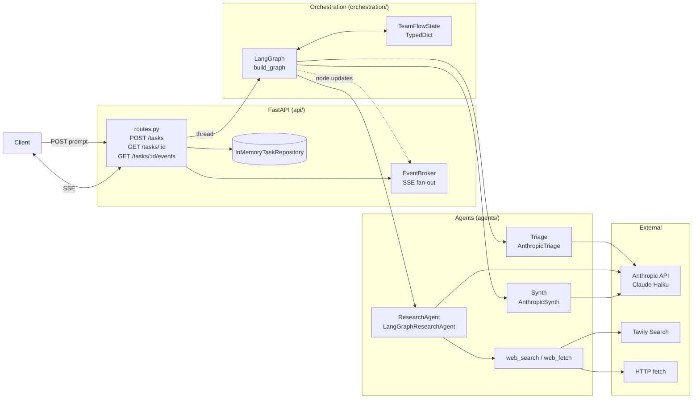
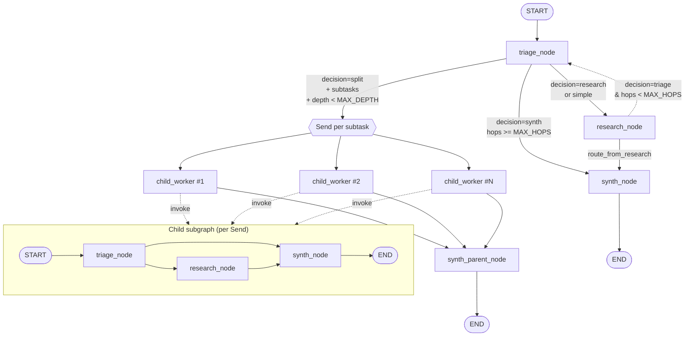
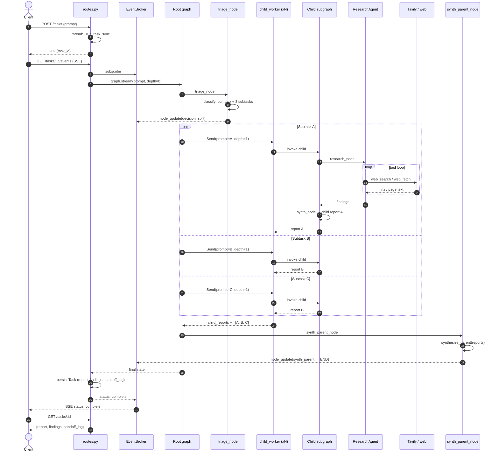

# TeamFlow Architecture

TeamFlow is a multi-agent research system built on **FastAPI** and **LangGraph**. A client submits a prompt; the system triages it, optionally decomposes it into parallel subtasks, runs a tool-using research agent per subtask, and synthesises a final report. Progress is streamed back over SSE.

## System architecture

The runtime is a single FastAPI app. Requests land in `api/routes.py`, tasks are stored in an in-memory `TaskRepository`, and execution happens in a background thread that drives the LangGraph orchestrator. An `EventBroker` fans per-node updates out to SSE subscribers.

## Agent graph

`build_graph` (`orchestration/graph.py`) assembles the top-level LangGraph. `triage_node` either routes a simple task straight to `research_node`, or — for a complex task at `depth=0` — fans out one `child_worker` per subtask using `Send`. Each child runs a flat triage → research → synth subgraph. Child reports are reduced into `child_reports` and rolled up by `synth_parent_node`.

Notes:
- `MAX_DEPTH = 1`: only the root may fan out; children are flat.
- `MAX_HOPS = 6`: a global circuit breaker that forces early synthesis.
- `CHILD_CONCURRENCY`: a `threading.Semaphore` caps parallel child subgraphs, since `graph.stream` runs Sends in a thread pool.
- Inside `research_node`, `LangGraphResearchAgent` runs its own inner graph: `llm_call ↔ tool_node` (see `agents/research.py`).

## Example execution flow

A complex query like *"Compare the positioning of Anthropic, OpenAI, and Google DeepMind in 2026."* Triage decomposes it into three subtasks, each runs its own research/synth pipeline in parallel, and results are rolled up.

## Key files

- `api/app.py`, `api/routes.py` — FastAPI wiring, task thread, SSE endpoint.
- `orchestration/graph.py` — root graph + child subgraph + `Send` fan-out.
- `orchestration/state.py` — `TeamFlowState` with `add`-reduced `child_reports` and `handoff_log`.
- `agents/triage.py`, `agents/research.py`, `agents/synth.py` — the three agent roles.
- `agents/tools.py` — `web_search` and `web_fetch` tools bound to the research LLM.
- `infrastructure/events.py` — per-task pub/sub for SSE.
